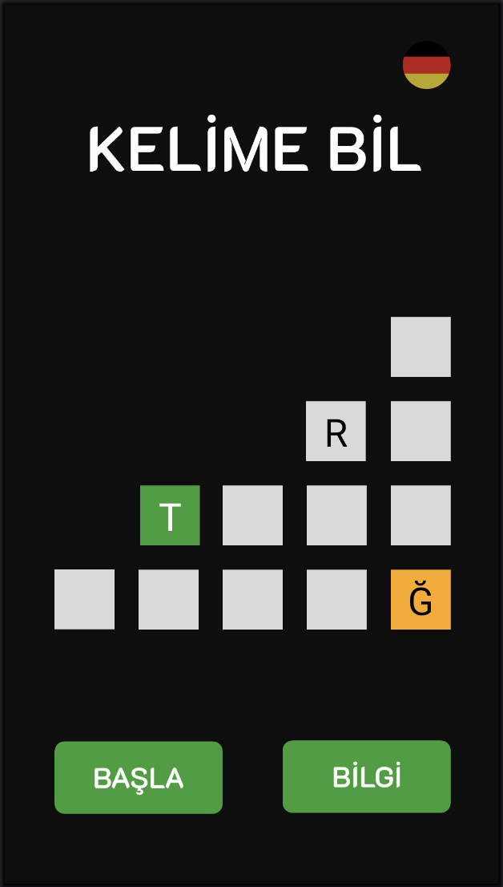
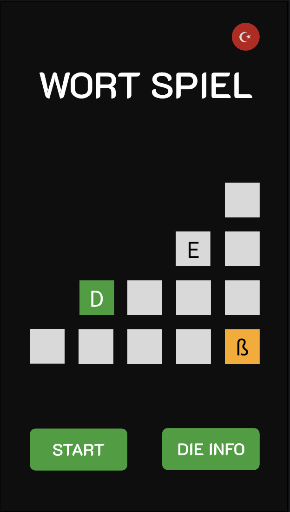
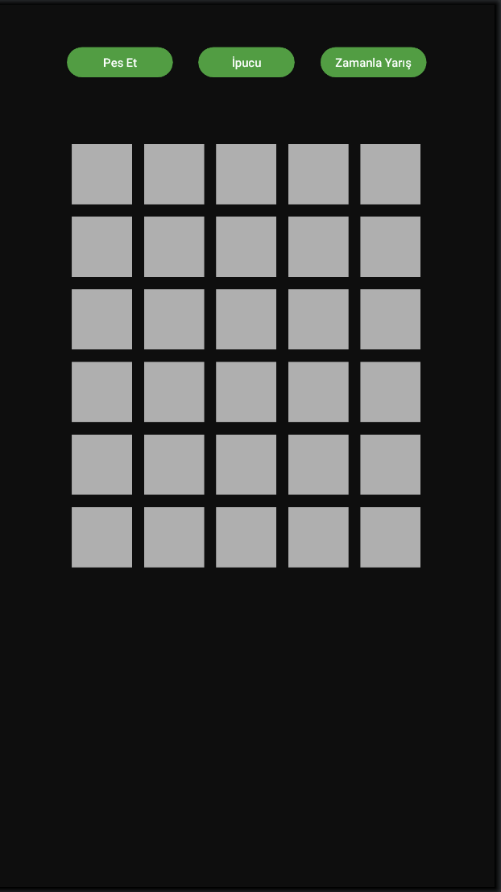
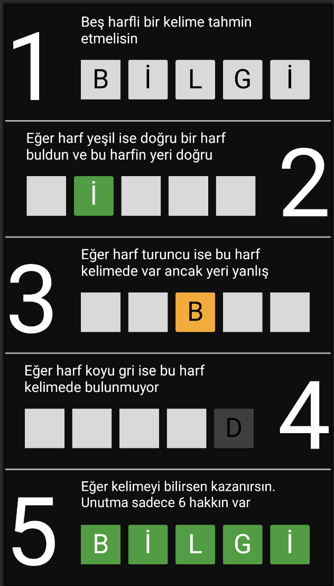
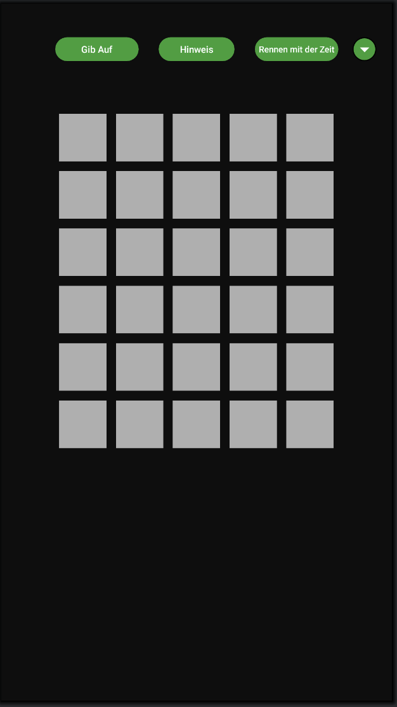
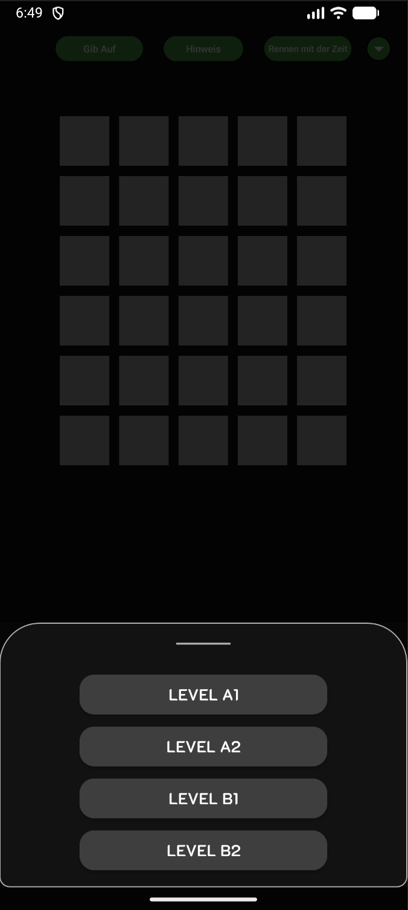
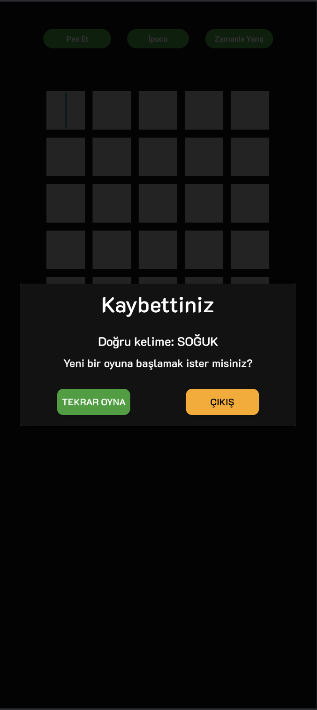
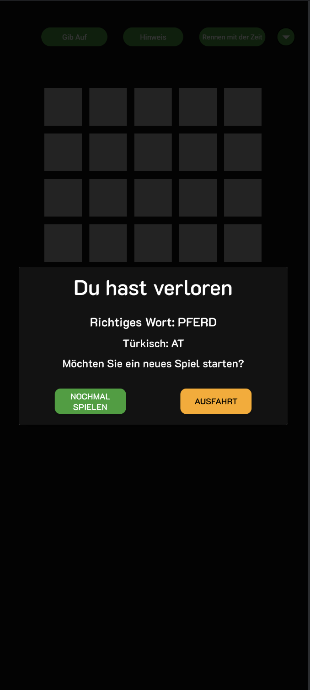

<div align="center">

# 🎯 Kelime Bil / Wort Spiel

### Türkçe & Almanca Kelime Tahmin Oyunu | Türkisch & Deutsches Wortratespiel

[](https://kotlinlang.org/)
[](https://developer.android.com/)
[]()
[]()

<br>

*Wordle tarzı bir kelime tahmin oyunu — iki dilde oynayın!*

*Ein Wordle-ähnliches Wortratespiel — spielen Sie in zwei Sprachen!*

---

</div>

## 📖 Hakkında | Über das Spiel

**Kelime Bil**, beş harfli kelimeleri tahmin etmeye dayanan, **Türkçe** ve **Almanca** dillerinde oynanabilen bir Android kelime oyunudur. Popüler Wordle oyunundan ilham alınarak geliştirilmiştir. Oyuncular, ana ekranda bayrak ikonlarıyla tek tıkla dil değiştirebilir ve seçilen dile göre tamamen farklı bir oyun deneyimi yaşar.

**Wort Spiel** ist ein Android-Wortspiel, bei dem fünfbuchstabige Wörter erraten werden müssen. Es kann auf **Türkisch** und **Deutsch** gespielt werden. Inspiriert vom beliebten Wordle-Spiel, können Spieler mit einem Klick auf die Flaggensymbole die Sprache wechseln.

---

## 🌍 Çift Dil Desteği | Zweisprachige Unterstützung

> Bu proje, gerçek bir **çift dilli (bilingual)** deneyim sunar. Dil değişikliği yalnızca metinlerin çevrilmesi değil, aynı zamanda **arayüz düzeni, klavye, veri tabanı ve oyun mantığının** tamamen o dile uyarlanması anlamına gelir.

<table>
<tr>
<td width="50%" align="center">

### 🇹🇷 Türkçe Modu

</td>
<td width="50%" align="center">

### 🇩🇪 Almanca Modu (Deutsch)

</td>
</tr>
<tr>
<td align="center">

<!-- Türkçe ana sayfa ekran görüntüsünü buraya ekleyin -->
<!-- Örnek: -->


*Türkçe ana sayfa tasarımı*

</td>
<td align="center">

<!-- Almanca ana sayfa ekran görüntüsünü buraya ekleyin -->
<!-- Örnek: -->


*Almanca ana sayfa tasarımı*

</td>
</tr>
</table>


---

## 🇹🇷 Türkçe

### Özellikler

| Özellik | Açıklama |
|---------|----------|
| 🎮 **Kelime Tahmini** | 5 harfli Türkçe kelimeleri 6 denemede tahmin edin |
| 🟢 **Harf Renkleri** | Yeşil = doğru yer, 🟠 Turuncu = yanlış yer, ⬛ Koyu Gri = kelimede yok |
| 💡 **İpucu Sistemi** | Rastgele bir doğru harfi ortaya çıkarır (tek kullanımlık) |
| ⏱️ **Zamanla Yarış** | Geri sayımlı zamanlama modu ile süre rekorları kırın |
| 🏆 **Rekor Takibi** | En iyi süreniz kaydedilir ve ekranda gösterilir |
| 🏳️ **Pes Etme** | İstediğiniz zaman doğru kelimeyi öğrenip yeni oyun başlatın |
| 🤨 **Ayıp Kelime Filtresi** | Uygunsuz kelimeler girildiğinde özel uyarı |

### Oyun Ekranları

<table>
<tr>
<td width="50%" align="center">



*Oyun paneli*

</td>
<td width="50%" align="center">



*Bilgi paneli*

</td>
</tr>
</table>

### Nasıl Oynanır?

1. 🏠 Ana ekranda **BAŞLA** butonuna basın
2. ✍️ 5 harfli bir Türkçe kelime yazın
3. 🎨 Renk ipuçlarını takip edin:
   - 🟩 **Yeşil** → Harf doğru ve doğru yerde
   - 🟧 **Turuncu** → Harf kelimede var ama yanlış yerde
   - ⬛ **Koyu Gri** → Harf kelimede yok
4. 🔄 6 deneme hakkınız var — doğru kelimeyi bulun!

---

## 🇩🇪 Deutsch

### Funktionen

| Funktion | Beschreibung |
|----------|-------------|
| 🎮 **Wort erraten** | Erraten Sie 5-buchstabige deutsche Wörter in 6 Versuchen |
| 📊 **Sprachniveaus** | Wählen Sie Ihren Level: A1, A2, B1 oder B2 |
| 🟢 **Buchstabenfarben** | Grün = richtige Stelle, 🟠 Orange = falsche Stelle, ⬛ Dunkelgrau = nicht im Wort |
| 💡 **Hinweis-System** | Deckt einen zufälligen richtigen Buchstaben auf (einmalig) |
| ⏱️ **Rennen mit der Zeit** | Zeitmodus mit Countdown und Rekordverfolgung |
| 🏆 **Rekordverfolgung** | Ihre beste Zeit wird gespeichert und angezeigt |
| 🏳️ **Aufgeben** | Sehen Sie jederzeit das richtige Wort und starten Sie ein neues Spiel |
| 🇹🇷 **Türkische Übersetzung** | Im deutschen Modus wird die türkische Bedeutung des Wortes angezeigt |

### Spielbildschirme

<table>
<tr>
<td width="50%" align="center">



*Spielfeld*

</td>
<td width="50%" align="center">



*Sprachniveaus*

</td>
</tr>
</table>

### Wie spielt man?

1. 🏠 Drücken Sie auf dem Startbildschirm auf **START**
2. ✍️ Geben Sie ein deutsches Wort mit 5 Buchstaben ein
3. 🎨 Folgen Sie den Farbhinweisen:
   - 🟩 **Grün** → Buchstabe ist richtig und an der richtigen Stelle
   - 🟧 **Orange** → Buchstabe ist im Wort, aber an der falschen Stelle
   - ⬛ **Dunkelgrau** → Buchstabe ist nicht im Wort
4. 🔄 Sie haben 6 Versuche — finden Sie das richtige Wort!

---

## 🔀 Dil Karşılaştırması | Sprachvergleich

Aşağıdaki tablo, iki dil modu arasındaki temel farkları göstermektedir:

| Özellik / Funktion | 🇹🇷 Türkçe | 🇩🇪 Deutsch |
|---------------------|-----------|------------|
| **Uygulama Adı** | Kelime Bil | Wort Spiel |
| **Kelime Havuzu** | Türkçe 5 harfli kelimeler | Almanca 5 harfli kelimeler |
| **Veri Tabanı** | `VeriTabani.kt` | `VeriTabani_De.kt` |
| **Oyun Paneli** | `OyunPanel.kt` | `OyunPanel_De.kt` |
| **Klavye Düzeni** | Türkçe klavye (Ğ, Ş, İ, Ö, Ü, Ç) | Alman klavyesi (ß, Ä, Ö, Ü) |
| **Arayüz Düzeni** | `layout/` | `layout-de/` |
| **String Kaynakları** | `values/strings.xml` | `values-de/strings.xml` |
| **Seviye Sistemi** | — | A1, A2, B1, B2 |
| **Çeviri Gösterimi** | — | Kelimenin Türkçe anlamı gösterilir |

---

## 🏗️ Teknik Mimari | Technische Architektur

### Proje Yapısı

```
app/src/main/
├── java/com/aliosman/kelimeoyunuprojesi/
│   ├── view/                        # Ekranlar / Bildschirme
│   │   ├── MainActivity.kt          # Ana aktivite & dil yönlendirmesi
│   │   ├── GirisPanel.kt            # Giriş ekranı & dil seçimi
│   │   ├── BilgiPanel.kt            # Bilgi / nasıl oynanır
│   │   ├── OyunPanel.kt             # 🇹🇷 Türkçe oyun paneli
│   │   └── OyunPanel_De.kt          # 🇩🇪 Almanca oyun paneli
│   │
│   ├── database/                    # Veri katmanı / Datenschicht
│   │   ├── VeriTabani.kt            # 🇹🇷 Türkçe kelime veritabanı
│   │   ├── VeriTabani_De.kt         # 🇩🇪 Almanca kelime veritabanı
│   │   ├── KelimeVarMi.kt           # Kelime doğrulama
│   │   ├── LanguageManager.kt       # Dil tercihi yönetimi
│   │   └── SharedPreferencesLevel.kt # Seviye kaydetme
│   │
│   └── util/                        # Yardımcı sınıflar / Hilfsklassen
│       ├── RekorIslemleri.kt         # Rekor süre işlemleri
│       └── Renkler.kt               # Renk tanımları
│
└── res/
    ├── layout/                       # 🇹🇷 Türkçe arayüz dosyaları
    ├── layout-de/                    # 🇩🇪 Almanca arayüz dosyaları
    ├── values/strings.xml            # 🇹🇷 Türkçe stringler
    ├── values-de/strings.xml         # 🇩🇪 Almanca stringler
    ├── drawable/
    │   ├── tr_flag.xml               # 🇹🇷 Türk bayrağı
    │   ├── de_flag.xml               # 🇩🇪 Alman bayrağı
    │   └── kelimebilicon.png         # Uygulama ikonu
    └── navigation/                   # Navigasyon grafığı
```

### Kullanılan Teknolojiler | Verwendete Technologien

| Teknoloji | Açıklama |
|-----------|----------|
| **Kotlin** | Ana programlama dili |
| **View Binding** | Tip güvenli view erişimi |
| **Navigation Component** | Fragment navigasyonu ve Safe Args |
| **Coroutines** | Asenkron veritabanı işlemleri |
| **SharedPreferences** | Dil ve seviye tercihi kaydetme |
| **SQLite** | Kelime veritabanı yönetimi |
| **ConstraintLayout** | Responsive arayüz tasarımı |
| **Material Design** | Modern Android UI bileşenleri |
| **CardView** | Buton ve kart tasarımları |

---

## ⚙️ Kurulum | Installation

### Gereksinimler | Voraussetzungen

- Android Studio Hedgehog (2023.1.1) veya üstü
- Minimum SDK: **API 28** (Android 9.0 Pie)
- Target SDK: **API 34** (Android 14)
- Kotlin 1.9+

### Adımlar | Schritte

```bash
# 1. Repoyu klonlayın | Klonen Sie das Repository
git clone https://github.com/dimetileter/Kelime-Bil.git

# 2. Android Studio ile açın | Öffnen Sie es in Android Studio
# File -> Open -> Kelime-Bil klasörünü seçin

# 3. Gradle senkronizasyonunu bekleyin
# Warten Sie auf die Gradle-Synchronisation

# 4. Çalıştırın | Ausführen
# Run -> Run 'app' veya Shift + F10
```

---

## 🎨 Renk Şeması | Farbschema

| Renk | Hex | Kullanım |
|------|-----|----------|
| 🟩 Yeşil / Grün | `#2E9F33` | Doğru harf, doğru yer |
| 🟧 Turuncu / Orange | `#FFA800` | Doğru harf, yanlış yer |
| 🟦 Mavi / Blau | `#24A1B2` | İpucu harfi |
| ⬛ Koyu Gri / Dunkelgrau | `#3E3E3E` | Kelimede olmayan harf |
| 🖤 Arkaplan / Hintergrund | `#0E0E0E` | Ana arkaplan rengi |

---

## 📸 Tüm Ekran Görüntüleri | Alle Screenshots

<table>
<tr>
<th colspan="3" align="center">🇹🇷 Türkçe</th>
<th colspan="3" align="center">🇩🇪 Deutsch</th>
</tr>
<tr>
<td align="center">

<br><em>Ana Sayfa</em>
</td>
<td align="center">

<br><em>Oyun Ekranı</em>
</td>
<td align="center">

<br><em>Bitiş Ekranı</em>
</td>
<td align="center">

<br><em>Startseite</em>
</td>
<td align="center">

<br><em>Spielfeld</em>
</td>
<td align="center">

<br><em>Endbildschirm</em>
</td>
</tr>
</table>

---

## 🤝 Katkıda Bulunma | Mitwirken

Katkılarınızı memnuniyetle karşılarız! | Beiträge sind willkommen!

1. Bu depoyu **fork** edin
2. Yeni bir **branch** oluşturun (`git checkout -b feature/yeni-ozellik`)
3. Değişikliklerinizi **commit** edin (`git commit -m 'Yeni özellik eklendi'`)
4. Branch'inizi **push** edin (`git push origin feature/yeni-ozellik`)
5. Bir **Pull Request** açın

---

## 📄 Lisans | Lizenz

Bu proje MIT Lisansı ile lisanslanmıştır. | Dieses Projekt ist unter der MIT-Lizenz lizenziert.

---

<div align="center">

**Kelime Bil** ile kelime dünyasına dalın! 🎯

*Tauchen Sie ein in die Welt der Wörter mit **Wort Spiel**!* 🎯

<br>

⭐ Bu projeyi beğendiyseniz yıldız vermeyi unutmayın! | Vergessen Sie nicht, einen Stern zu geben!

</div>
